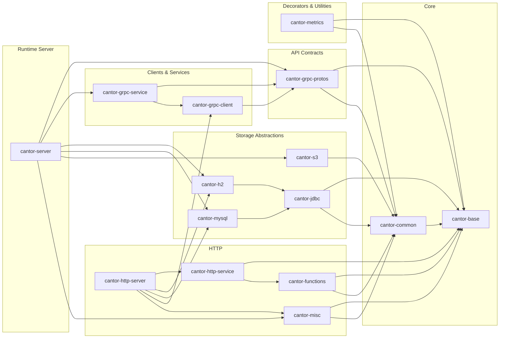

### Module dependency graph

```mermaid
graph LR
  subgraph Core
    base["cantor-base"]
    common["cantor-common"] --> base
  end

  subgraph Storage Abstractions
    jdbc["cantor-jdbc"] --> base
    jdbc --> common
    h2["cantor-h2"] --> jdbc
    mysql["cantor-mysql"] --> jdbc
    s3["cantor-s3"] --> common
  end

  subgraph API Contracts
    protos["cantor-grpc-protos"] --> base
    protos --> common
  end

  subgraph Clients & Services
    grpcClient["cantor-grpc-client"] --> protos
    grpcService["cantor-grpc-service"] --> protos
    grpcService --> grpcClient
  end

  subgraph HTTP
    httpSvc["cantor-http-service"] --> base
    httpSvc --> funcs
    httpSrv["cantor-http-server"] --> httpSvc
    httpSrv --> h2
    httpSrv --> mysql
    httpSrv --> grpcClient
    httpSrv --> misc
  end

  subgraph Decorators & Utilities
    misc["cantor-misc"] --> base
    misc --> common
    metrics["cantor-metrics"] --> base
    metrics --> common
    funcs["cantor-functions"] --> base
    funcs --> common
  end

  subgraph Runtime Server
    server["cantor-server"] --> protos
    server --> grpcService
    server --> h2
    server --> mysql
    server --> s3
    server --> misc
  end
```
