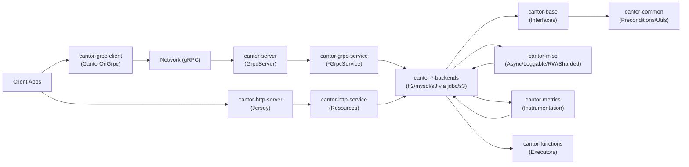

### Cantor Architecture Overview

Below is a high-level view of Cantor’s components and how they interact.

### Module Index
- [`cantor-base`](modules/cantor-base.md)
- [`cantor-common`](modules/cantor-common.md)
- [`cantor-functions`](modules/cantor-functions.md)
- [`cantor-grpc-protos`](modules/cantor-grpc-protos.md)
- [`cantor-grpc-client`](modules/cantor-grpc-client.md)
- [`cantor-grpc-service`](modules/cantor-grpc-service.md)
- [`cantor-jdbc`](modules/cantor-jdbc.md)
- [`cantor-h2`](modules/cantor-h2.md)
- [`cantor-mysql`](modules/cantor-mysql.md)
- [`cantor-s3`](modules/cantor-s3.md)
- [`cantor-http-service`](modules/cantor-http-service.md)
- [`cantor-http-server`](modules/cantor-http-server.md)
- [`cantor-metrics`](modules/cantor-metrics.md)
- [`cantor-misc`](modules/cantor-misc.md)
- [`cantor-server`](modules/cantor-server.md)
- [`gRPC overview`](modules/cantor-grpc.md)
